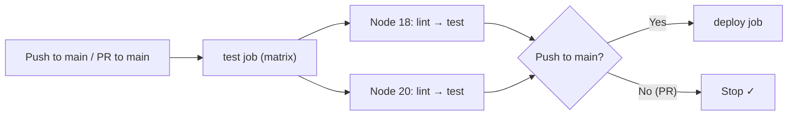

# 🔧 Labsheet 12 — Part 4: CI/CD & Git Recovery

---

## (a) GitHub Actions CI/CD Workflow

The workflow file is located at [`.github/workflows/ci.yml`](.github/workflows/ci.yml).

### What the Workflow Does



| Feature | How It's Implemented |
|---|---|
| **Trigger** | `on: push` + `on: pull_request`, both filtered to `main` |
| **Node matrix** | `strategy.matrix.node-version: [18, 20]` — runs the test job twice in parallel |
| **npm caching** | `actions/setup-node@v4` with `cache: npm` — caches `~/.npm` across runs |
| **Lint first, then test** | Two sequential steps inside the same job: `npm run lint` then `npm test` |
| **Conditional deploy** | Separate `deploy` job with `needs: test` (waits for all matrix jobs) and `if: github.event_name == 'push'` (skips on PRs) |

### Key Points

- **`npm ci`** is used instead of `npm install` in CI because it does a clean, reproducible install from `package-lock.json` and is faster.
- **`needs: test`** on the deploy job ensures it only runs if **all** matrix variants of the test job succeed.
- **`if: github.event_name == 'push'`** prevents deployment from running on pull requests — we only deploy when code is actually merged into `main`.

---

## (b) Recovering Lost Commits After a Force-Push

### Scenario

A teammate ran `git push --force` to `main`, rewriting the remote history and erasing three commits from other developers.

### Recovery Steps

```bash
# ─── Step 1: Fetch the latest state (including the rewritten main) ───
git fetch origin

# ─── Step 2: Use reflog to find the last good state of main ───
# The reflog records every position HEAD (or a branch tip) has been at locally.
# Look for the commit hash BEFORE the force-push landed.
git reflog show origin/main
# Example output:
#   abc1234 origin/main@{0}: fetch: forced-update   ← the force-push (bad)
#   def5678 origin/main@{1}: fetch: fast-forward     ← last good state ✓

# ─── Step 3: Verify the lost commits are in the old history ───
git log def5678 --oneline -5

# ─── Step 4: Reset main back to the correct commit ───
git checkout main
git reset --hard def5678

# ─── Step 5: Force-push the corrected history back to remote ───
git push --force-with-lease origin main
```

> **Why `--force-with-lease` instead of `--force`?**
> `--force-with-lease` is a safer force-push — it will **refuse** to overwrite the remote if someone else has pushed new commits since your last fetch. This prevents accidentally losing even more work during the recovery.

### Alternative: Cherry-Pick if Reflog is Unavailable

If you don't have local reflog (e.g. fresh clone), but you know the commit SHAs from GitHub / teammates:

```bash
# Create a recovery branch from current main
git checkout -b recovery main

# Cherry-pick the three lost commits in order
git cherry-pick <commit-sha-1> <commit-sha-2> <commit-sha-3>

# Merge recovery back into main
git checkout main
git merge recovery

git push --force-with-lease origin main
```

### Prevention Rule

> **Enable branch protection rules on `main`** in GitHub → Settings → Branches → Add rule:
>
> ✅ **"Do not allow force pushes"**
>
> This setting **blocks all force pushes** to the protected branch, regardless of a user's role. Combined with **"Require pull request reviews before merging"**, it ensures that `main` can only move forward via reviewed, merge-commit PRs — making accidental history rewrites impossible.
